🚀 Lobees – Django – n8n Automation Integration
Automatización completa de tareas proactivas con formularios dinámicos

Este proyecto implementa una integración avanzada entre:

Lobees CRM

n8n (workflow automation)

Django (backend + formularios HTML)

El objetivo es automatizar completamente el envío, recepción y registro de tres formularios 
secuenciales, generados dinámicamente para cada lead, con logs automáticos y actualización del estado de la tarea en Lobees.

1. Creación de Leads en Lobees
El proceso comienza creando los leads a los que se les asignarán tareas proactivas.
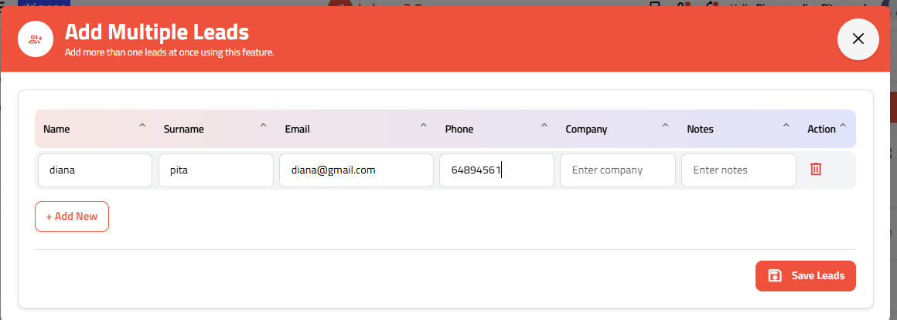
Descripción:  
Aquí se muestran los leads creados en Lobees. Estos leads serán los destinatarios de los formularios generados por n8n y enviados por Django.
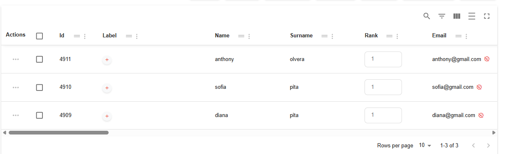
2. Creación de la Automatización Proactiva
Una vez creados los leads, se configura una automatización en Lobees con subtareas.
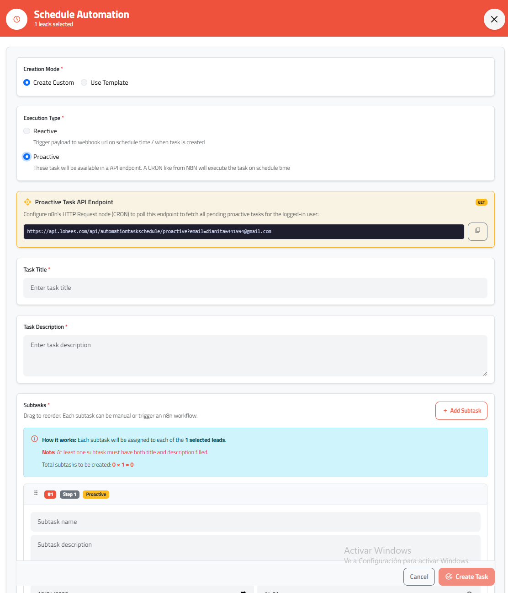
veremos el flujo donde 
Consulta tareas proactivas en Lobees

Filtra solo las tareas que están pendientes y que coinciden con un task_id 

Envía un callback a Lobees para marcar que la tarea está “en progreso
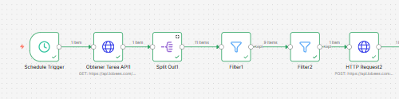
1. Schedule Trigger
Este nodo ejecuta el flujo cada minuto
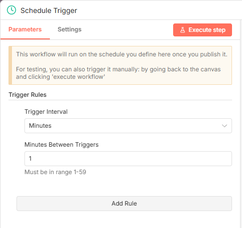
2.Obtener Tarea API1 (HTTP GET)
Hace una petición GET a:
2. https://api.lobees.com/api/automationtaskschedule/proactive?email=dianita6441994@gmail.com
Esto devuelve todas las tareas proactivas asignadas a ese email.

Salida típica:

json
{
  "status": true,
  "count": 10,
  "data": [ ... ]
}
3. Split Out1
Divide el array data en items individuales.

Esto permite procesar una tarea por vez.
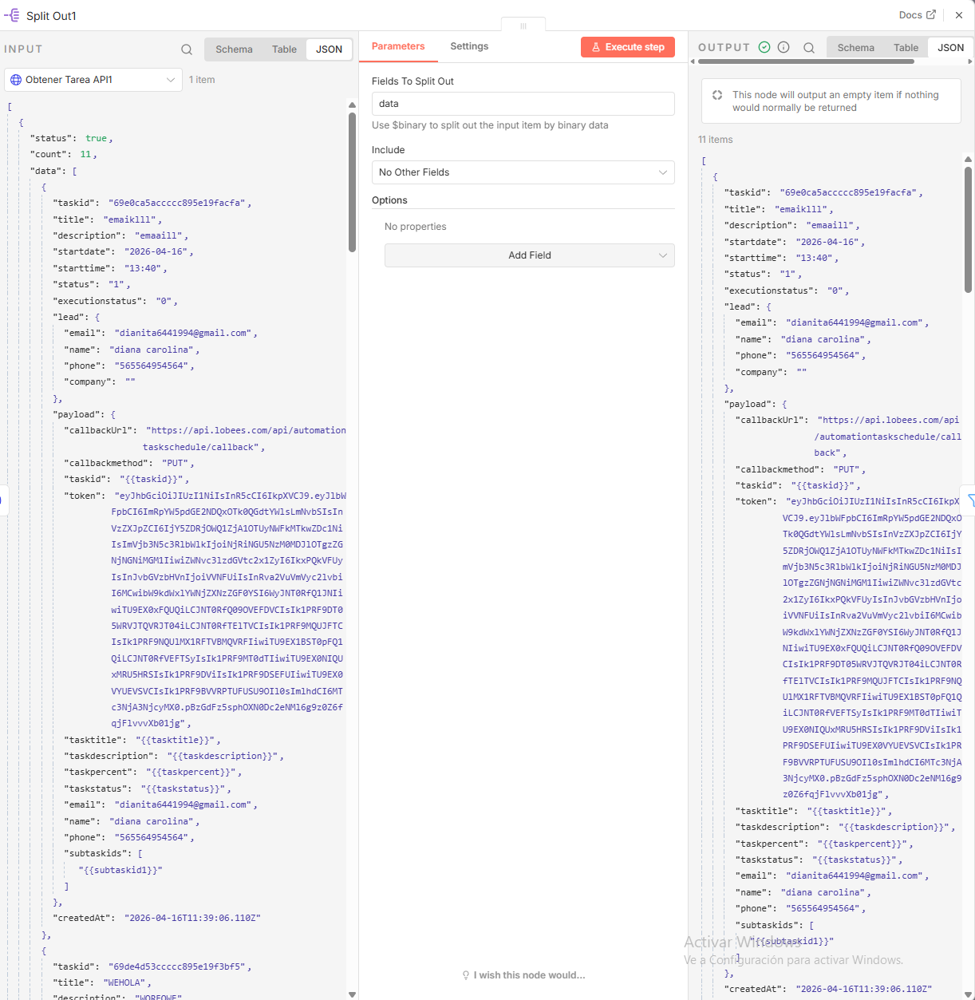
4. Filter1 – Filtrar por estado
Este nodo descarta tareas cuyo executionstatus sea:

1 → in progress

2 → testing

3 → completed

El filtro dice:

Código
executionstatus != 1
AND executionstatus != 2
AND executionstatus != 3
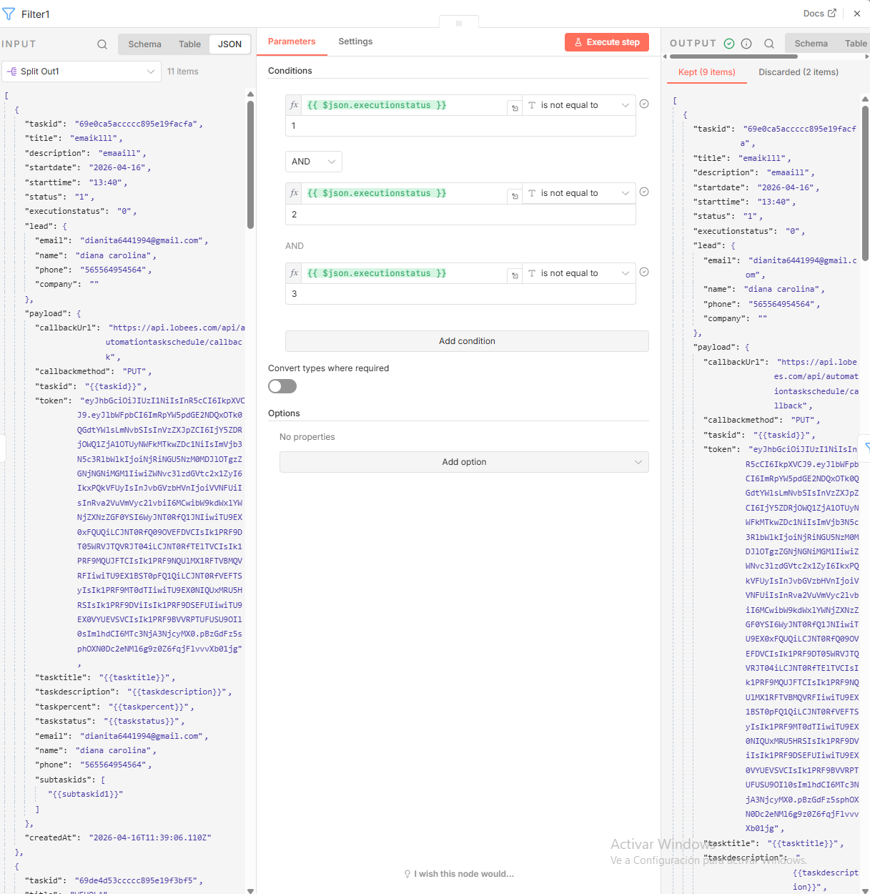
6. HTTP Request2 – Callback a Lobees
Este nodo envía un POST a:
https://api.lobees.com/api/automationtaskschedule/webhook/n8n/callback
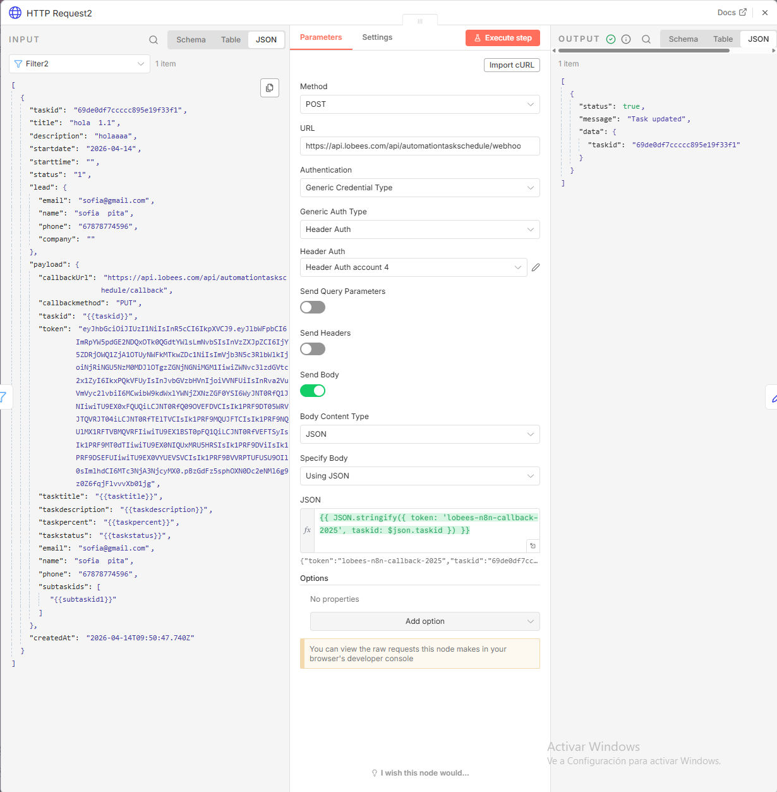
nos autentificamos 

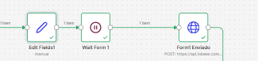

1. Edit Fields1 — Preparación de datos del Formulario 1
Este nodo construye las variables necesarias para enviar el primer formulario al lead.

 ¿Qué datos prepara?
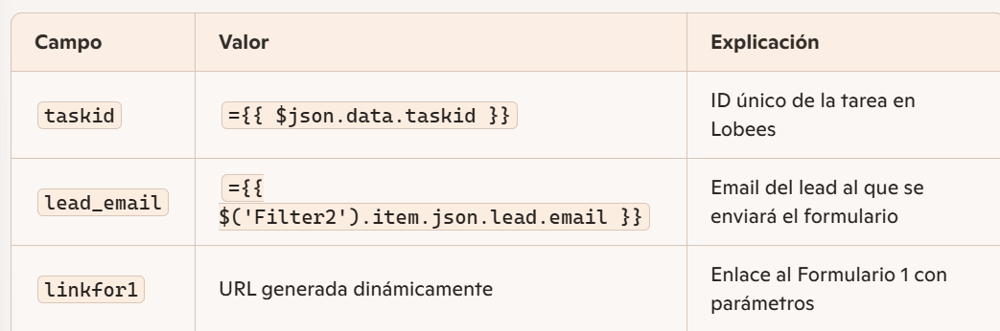
La URL generada tiene esta estructura:
http://127.0.0.1:8000/form/step1/<lead_email>/<taskid>/?n8n_url=<resumeUrl>
Esto es clave, porque:

identifica al lead

taskid identifica la tarea

n8n_url permite a Django resumir el workflow cuando el usuario envía el formulario
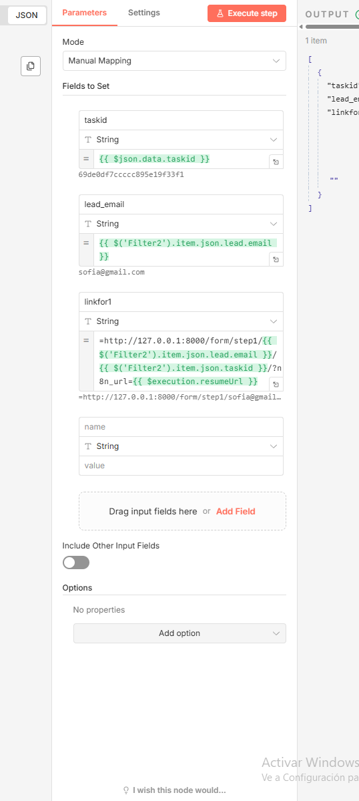
2. Wait Form 1 — Espera del webhook
Este nodo es el corazón del sistema.

¿Qué hace?
Detiene el workflow

Espera a que Django envíe un POST al webhook

Ese POST ocurre cuando el lead envía el Formulario 1

¿Por qué es importante?
Porque permite que el workflow:

No avance hasta que el usuario realmente complete el formulario
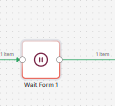
 ejemplo : http://127.0.0.1:8000/form/step1/sofia@gmail.com/69de0df7ccccc895e19f33f1/?n8n_url=http://localhost:5678/webhook-waiting/159230
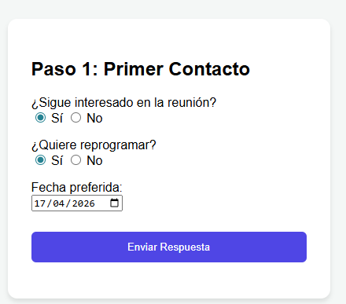
Mantenga el estado de la tarea sincronizado

Reanude exactamente donde se quedó
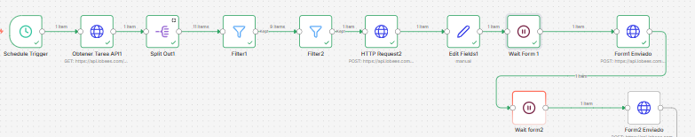

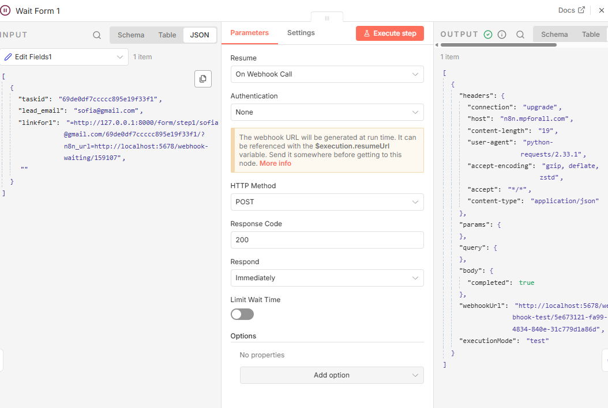 
3. Form1 Enviado — Registro del log en Lobees
Este nodo se ejecuta después de que el usuario envía el Formulario 1 y el webhook desbloquea el Wait.

¿Qué hace?
Envía un POST a:

https://api.lobees.com/api/project/addtasklog
Con este body:

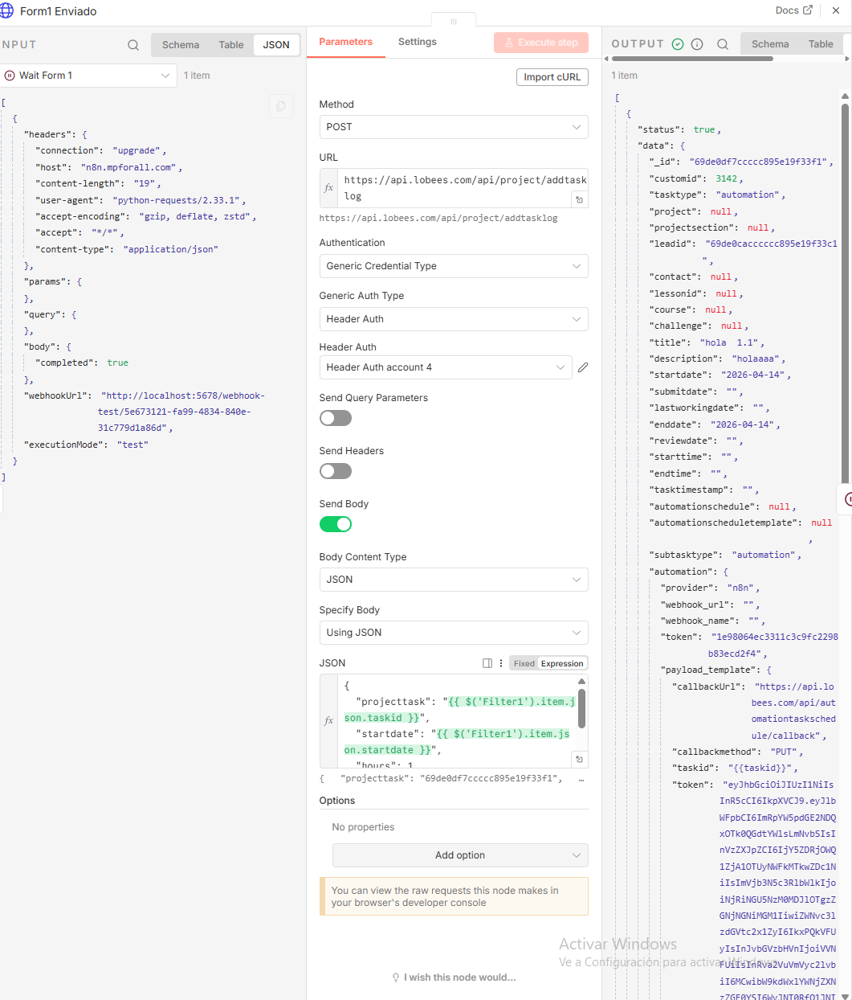
¿Qué significa?
Se registra un log en Lobees

Se indica que el Formulario 1 fue enviado y completado

Se actualiza el progreso de la tarea

El siguiente nodo indica que el formulario 2 aun no esta contestado por eso wait 2 espera respuesta
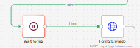
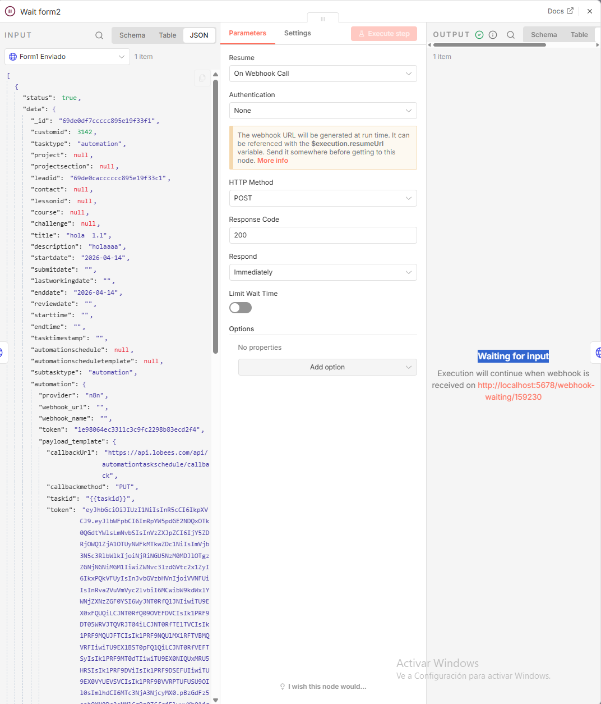

volvemos a la pagina donde nos espera la segunda parte del cuestionario 
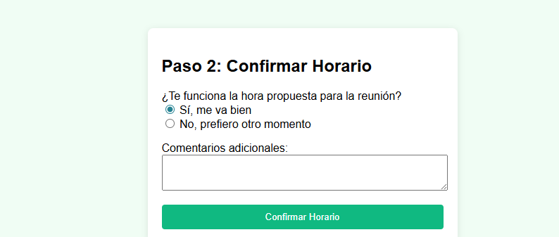
Donde responder el nodo se vuelve verde es que le a llegado la respuesta 
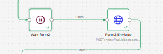

Esto se repite en el nodo 3 o el final del cuestionario 
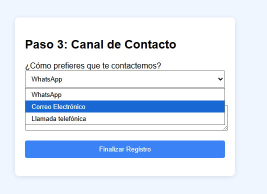
Ahora mandaremos nuestro questionario 
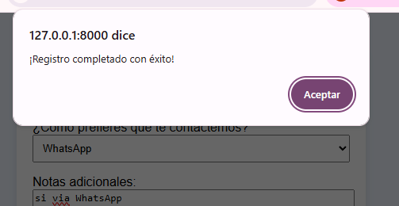
Donde aparece una ventana diciendo que ¡Registro completado con éxito!

En esta sección del panel de Django podemos ver cómo el sistema ha ido guardando cada uno de los formularios que el lead ha completado.
El lead sofia@gmail.com aparece con tres entradas:

Formulario 1

Formulario 2

Formulario 3

Cada uno con su hora exacta de creación.
Esto demuestra que el flujo automatizado está funcionando de principio a fin: el usuario recibe los formularios, los completa y Django los registra correctamente.
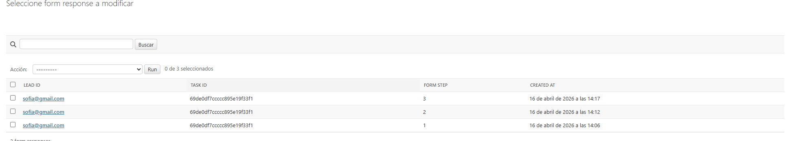

formulario 1
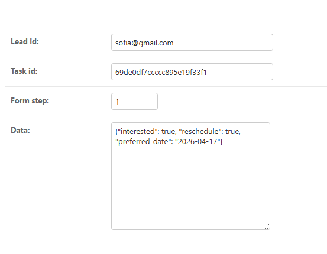

Formulario 2 
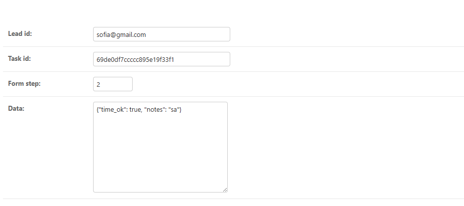

Formulario 3:
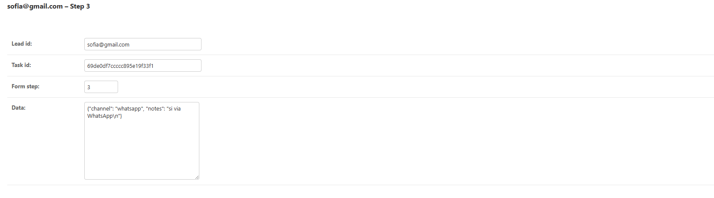

Nuestro flujo se ve asi :
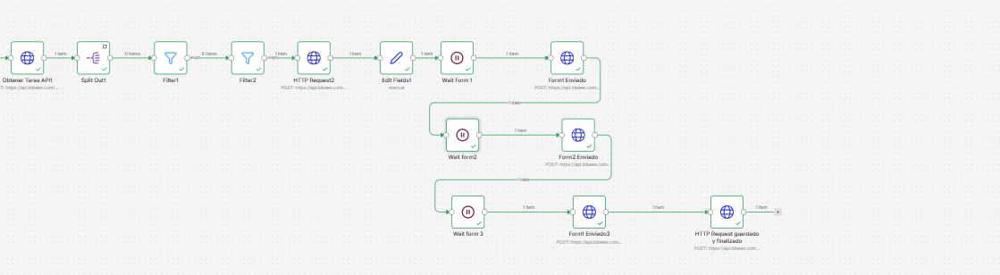

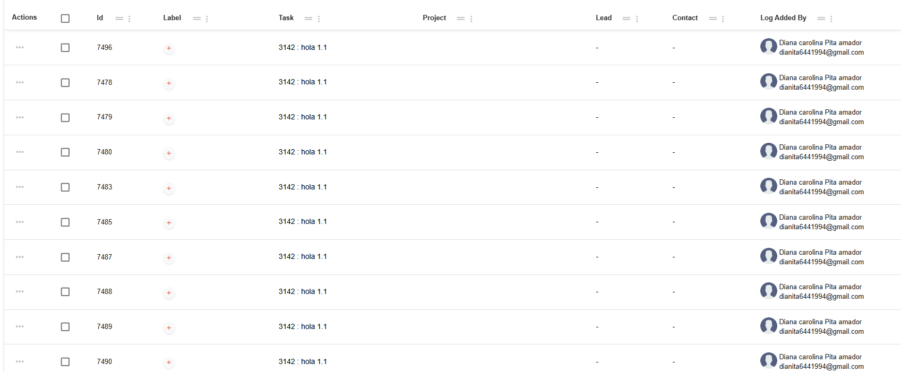
Aquí podemos ver cómo Lobees va registrando automáticamente cada acción que ocurre durante el proceso.
Cada vez que un lead completa un formulario, n8n envía un log al CRM, y este aparece reflejado en esta tabla.

Todos los registros pertenecen a la tarea “hola 1.1”, lo que demuestra que:

El workflow está activo

Los formularios se están enviando correctamente

Las respuestas están siendo procesadas

Lobees recibe y almacena cada evento
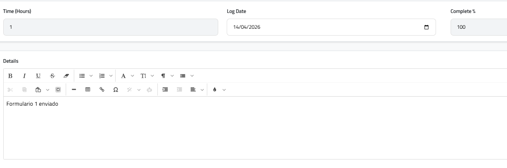
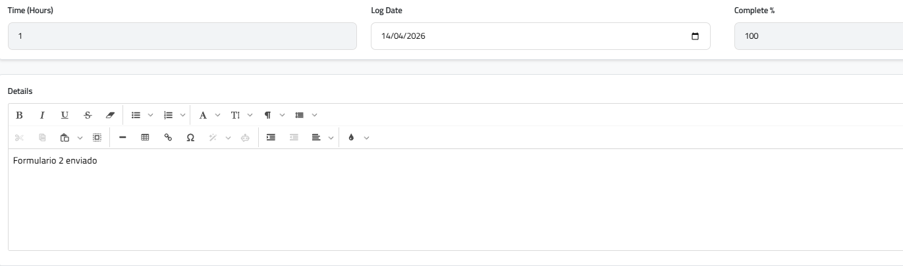

BACKEND

. Modelos (Models)
El backend utiliza dos modelos principales:
1.1 FormResponse
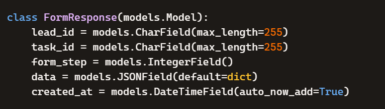
lead_id → email del lead

task_id → ID único de la tarea en Lobees

form_step → número del formulario (1, 2 o 3)

data → respuestas del formulario en JSON

created_at → fecha y hora de envío

1.2 LeadResume
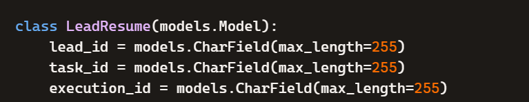
 permite construir URLs

2. Serializers
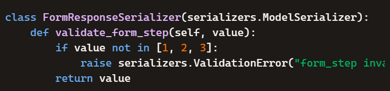
3. Validan que el paso del formulario sea correcto

Transforman datos entre JSON y objetos Django

Garantizan que la API reciba datos válidos
Funciones de Utilidad (utils)
Aquí están las funciones que conectan Django con Lobees y n8n.

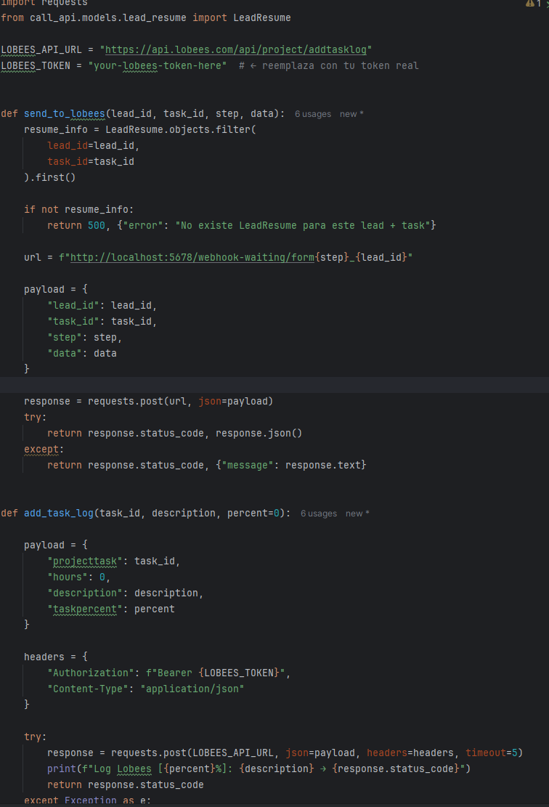
3.1 send_to_lobees
Esta función envía los datos del formulario a Lobees o al webhook de n8n.
¿Qué hace?
Busca el execution_id en LeadResume

Construye la URL dinámica

¿Por qué es clave?
Porque es la forma en que Django despierta al workflow de n8n.
3.2 add_task_log
Registra un log en Lobees
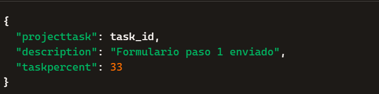
Para qué sirve?
Mostrar progreso en Lobees

Registrar actividad del lead

Mantener trazabilidad del proceso

4. Vistas (Views)
Cada formulario tiene dos vistas:

Una para mostrar el HTML

Otra para procesar el POST
form 1
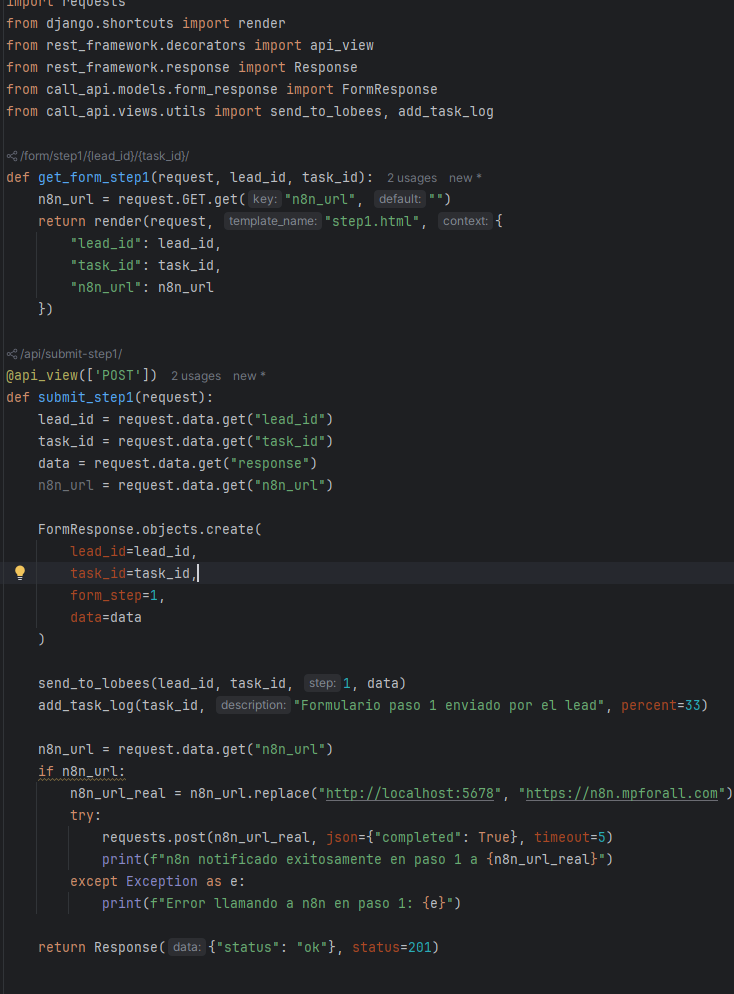
form 2 
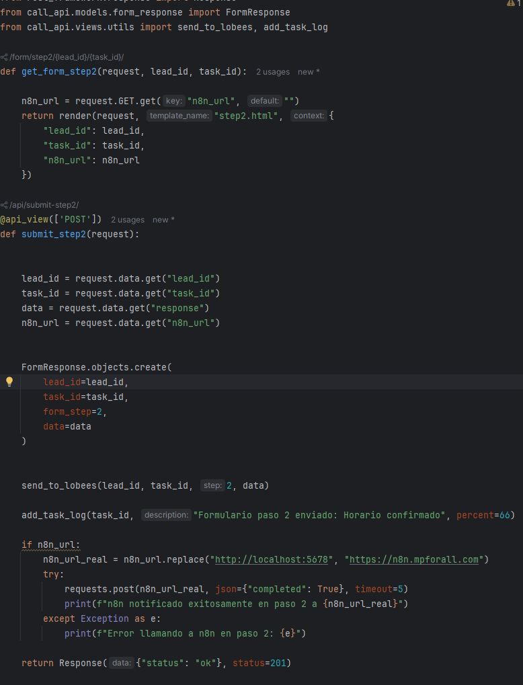
form 3
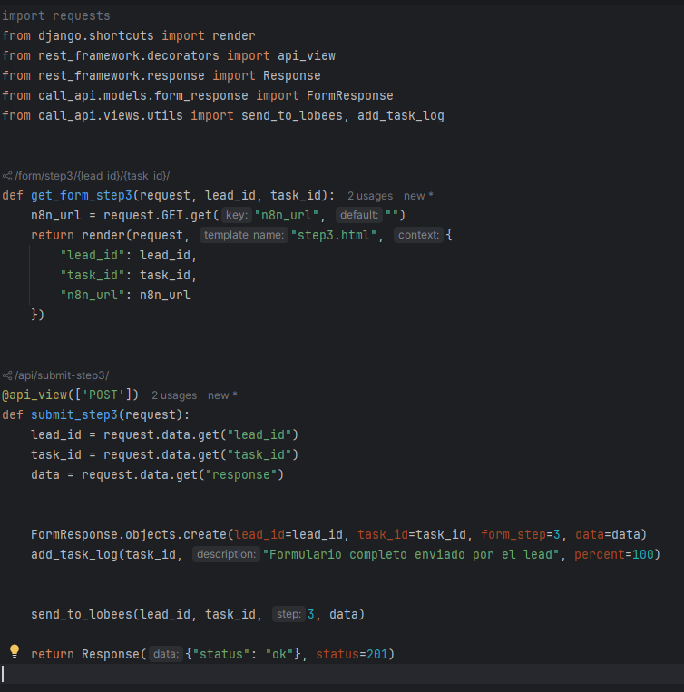

5. Webhooks
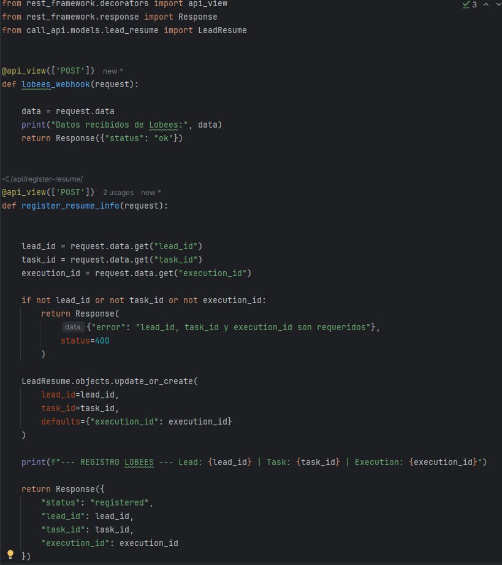
5.1 register_resume_info

Este endpoint recibe desde n8n:

lead_id

task_id

execution_id

Y lo guarda en LeadResume.

6. URLs
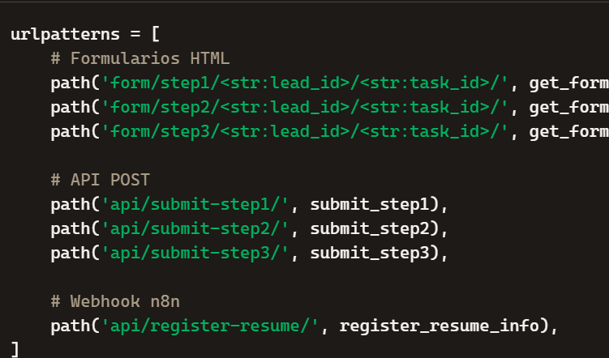

¿Qué define?
Rutas para los formularios

Rutas para los POST

Webhook para registrar execution_id

7. Workflow n8n – Lobees Automations Sync con Django
Este workflow es el núcleo de la automatización.
Se encarga de:

Consultar tareas proactivas en Lobees

Filtrar solo las que están pendientes

Generar enlaces personalizados para cada lead

Esperar a que el lead complete cada formulario

Registrar logs en Lobees

Avanzar paso a paso hasta completar la tarea

